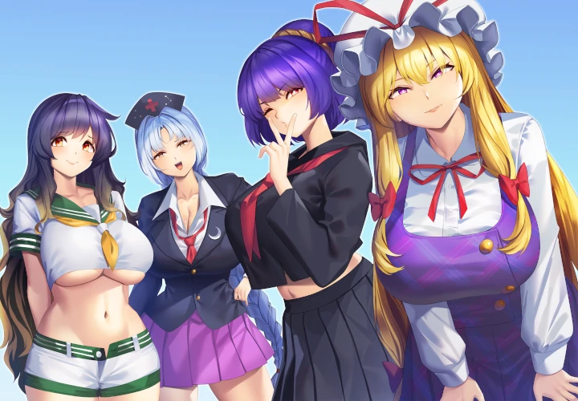
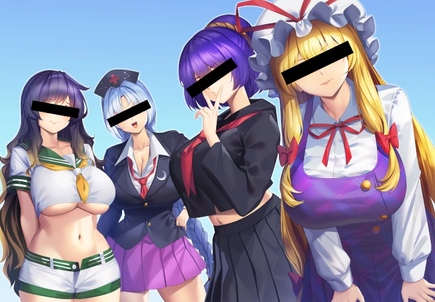

### Disclaimer: the entire project is vibe-coded.

# mekakushi

Draws a rotated black bar over the eyes of anime faces. Works with multiple characters in a single image.

| Before | After |
|---|---|
|  |  |

*Illustration by [@km83305315](https://x.com/km83305315)*

## Requirements

[uv](https://github.com/astral-sh/uv) - no manual `pip install` needed. Models are downloaded automatically on first run.

## Usage

```bash
# Single image
uv run main.py input.png output.png

# Batch (directory -> directory)
uv run main.py ./input/ ./output/
```

## Options

| Flag | Default | Effect |
|---|---|---|
| `--color R,G,B` | `0,0,0` | Bar colour |
| `--pad-x N` | `6` | Extra pixels left/right beyond face |
| `--pad-y N` | `2` | Extra pixels above/below eye region |
| `--eye-top F` | `0.34` | Top of bar as fraction of face height (fallback only) |
| `--eye-bot F` | `0.54` | Bottom of bar as fraction of face height (fallback only) |

## How it works

Uses [dghs-imgutils](https://github.com/deepghs/imgutils) for anime-specific face and eye detection, with [insightface](https://github.com/deepinsight/insightface) as a fallback for tricky cases. The bar is rotated to match the eye angle.

## License

[MIT License](./LICENSE)
